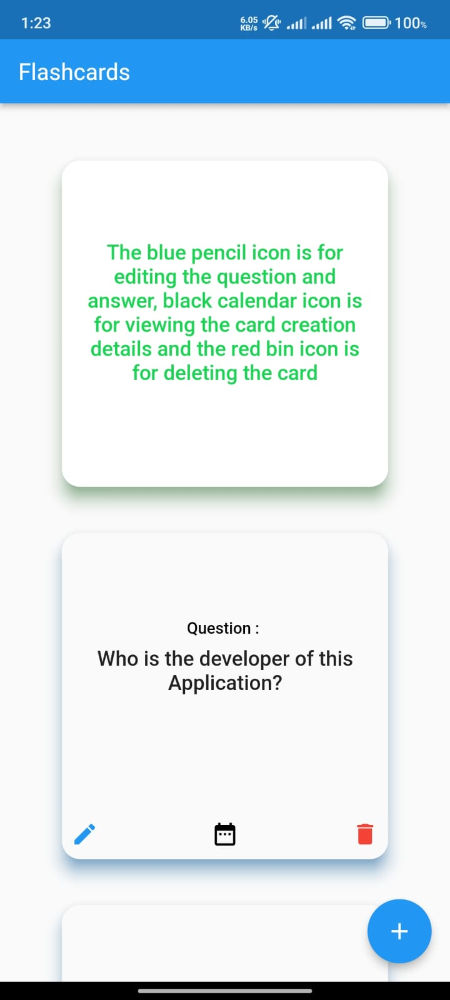

# Flashcard App using Flutter

A simple and interactive Flashcard app built using Flutter, where users can add, edit, and delete flashcards. The app helps users to create custom flashcards with a question and answer format, allowing for easy learning and revision.

## Features

- **Add Flashcards**: Create custom flashcards by entering a question and answer.
- **Edit Flashcards**: Modify existing flashcards.
- **Delete Flashcards**: Remove flashcards from the list.
- **User Interface**: Simple and clean interface to manage flashcards with options to edit and delete.
- **Visual Appealing**: The cards have a border color representing the question or answer or untapped card.
- **Smoothness**: When tapped on the card, it gets flipped and shows the answer side if it was previously displaying the question side and vice versa. 

## Technologies Used

- **Flutter**: A UI toolkit for building natively compiled applications for mobile from a single codebase.
- **Provider**: A state management solution to manage the app's state efficiently.
- **Material Design**: For the app's UI design and components.

## Installation

To run this project locally, you will need to have Flutter installed. Follow these steps:

1. **Clone the repository**:
   ```bash
   git clone https://github.com/Nikson2003/FlashCard-APP-using-Flutter.git

2. **Navigate into the project folder**:
   ```bash
   cd FlashCard-APP-using-Flutter

3. **Install the dependencies**:
   ```bash
   flutter pub get

4. **Run the app**:
   ```bash
   flutter run

## Screenshots

Some screenshots of the app.


This page shows the home screen where there are blue color bordored cards which means they are unflipped or their answer is not revealed.



This page shows the green color bordored card which means they are flipped and their answer is being shown.


This page shows the red color bordored card which means they are flipped and their question is being shown.


This is the page through which we can add the cards and it also has a proper validation mechanism.


Home screen after adding the cards.


This page allows to edit the card.


Option to delete the card.


Home screen after the card deleted(removed). 

## Acknowledgements

- Flutter and Dart for providing a powerful framework for building cross-platform mobile apps.
- Provider for easy state management.
